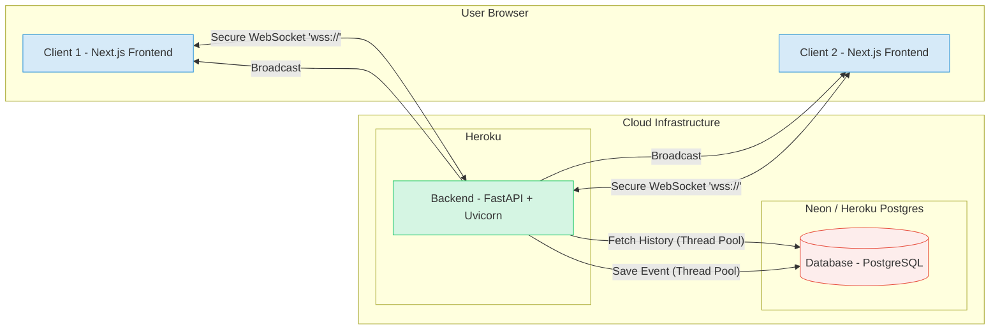

# Real-Time Collaborative Whiteboard

[](https://whiteboard.404by.me/)

A feature-rich, persistent, real-time collaborative whiteboard application built with FastAPI (WebSockets), Next.js (React), and PostgreSQL.


## Overview

This project implements a web-based whiteboard where multiple users can join a shared room and collaborate visually in real-time. Drawings, shapes, and chat messages appear instantly for all connected participants. The application state is persistently stored using an event-sourcing model, allowing users to rejoin sessions and view the complete drawing history.

The goal was to build a robust, **stateful** application demonstrating mastery of WebSocket communication, thread-safe asynchronous backend processing, data persistence for real-time systems, and a polished, responsive frontend user experience.

## Key Features

* **Real-Time Collaboration:** Changes made by one user (drawing, erasing, shapes, chat) are broadcast instantly to all other users in the same room via WebSockets.
* **Persistent Drawing State (Event Sourcing):** All drawing actions (`DRAW`, `SHAPE_ADD`, `ERASE`, `CLEAR`) are saved as individual events to a PostgreSQL database. Users joining a room receive the full event history, ensuring they always see the latest canvas state.
* **Multi-Tool Support:** Includes tools for free-form drawing (pen), rectangles, lines, arrows, and a pixel-level eraser.
* **Stable UI:** A clean, modern interface with a fixed sidebar for tools and chat, designed using Flexbox to work seamlessly on various screen sizes.
* **Integrated Chat:** A dedicated chat window allows users within the same room to communicate via text messages.
* **User Identity:** Simple user naming stored in `localStorage` for session continuity and chat identification, editable within the UI.
* **Shareable Rooms:** Automatically generates unique room IDs upon visiting the root URL and provides an easy "Copy Link" button for sharing.
* **Human-Readable Room Names:** Displays fun, generated names (e.g., "Happy Forest 965b") in the UI while using secure UUIDs for routing.
* **Coordinate Normalization:** Ensures drawings render correctly across different screen sizes and resolutions by transmitting relative coordinates (0.0-1.0).

## Architecture

The application follows a client-server architecture designed for stateful, real-time communication.




1.  **Frontend (Next.js on Vercel):**
    * Handles rendering the UI (Canvas, Sidebar, Chat), capturing user input (mouse events, text).
    * Establishes a persistent **Secure WebSocket (`wss://`)** connection to the backend server for a specific room.
    * Sends drawing, shape, erase, and chat events to the backend over the WebSocket using **normalized coordinates**.
    * Receives events broadcast from the backend:
        * `HISTORY`: A batch of past events on initial connection.
        * `DRAW`, `SHAPE_ADD`, `ERASE`, `CLEAR`, `CHAT`: Live updates from other users.
    * Renders received events onto the **single HTML5 Canvas** or into the chat window.

2.  **Backend (FastAPI on Heroku):**
    * Manages WebSocket connections using an in-memory `ConnectionManager`.
    * Accepts new connections, associating them with a `roomId`.
    * On connection, fetches the room's entire event history from the PostgreSQL database **asynchronously and safely** (using `run_in_threadpool` with **thread-local database sessions**) and sends it to the new client.
    * Receives events from clients.
    * For persistent events (draw, shape, erase, clear), it saves the event to the PostgreSQL database **asynchronously and safely** using the same thread-safe pattern.
    * **Immediately broadcasts** the received event to all *other* clients in the same room using a **resilient** broadcast loop (handles potential errors during sending without crashing).

3.  **Database (PostgreSQL on Neon or Heroku Postgres):**
    * Acts as the persistent storage layer using an **event sourcing** model.
    * Stores every drawing, shape, erase, and clear action as an immutable event in the `whiteboard_events` table, linked to a `roomId` and timestamp. This enables reliable history replay.

## Technology Stack

**Backend:**
* **Framework:** FastAPI
* **Language:** Python 3.9+
* **Real-Time:** WebSockets (`websockets` library via FastAPI/Uvicorn)
* **Database:** PostgreSQL
* **ORM:** SQLAlchemy
* **Migrations:** Alembic
* **Async:** `asyncio`, `starlette.concurrency.run_in_threadpool`

**Frontend:**
* **Framework:** Next.js (App Router)
* **Language:** TypeScript
* **UI Library:** React
* **Styling:** Tailwind CSS
* **Drawing:** HTML5 Canvas API

**Infrastructure:**
* **Containerization:** Docker, Docker Compose
* **Deployment (Backend):** Heroku (Container Stack)
* **Deployment (Frontend):** Vercel
* **Deployment (Database):** Neon (Serverless PostgreSQL) or Heroku Postgres

## Running Locally

1.  **Prerequisites:**
    * Docker & Docker Compose
    * Node.js & npm (for the frontend)
    * Python 3.9+ & pip (for the backend venv, optional if only using Docker)

2.  **Clone the Repository:**
    ```bash
    git clone <your-repo-url>
    cd real-time-whiteboard
    ```

3.  **Backend Setup (Optional - for local venv):**
    * Navigate to the `backend` directory: `cd backend`
    * Create a virtual environment: `python3 -m venv venv && source venv/bin/activate`
    * Install dependencies: `pip install -r requirements.txt`
    * Navigate back to the root: `cd ..`

4.  **Start Services with Docker Compose:**
    From the **root** (`real-time-whiteboard`) directory, run:
    ```bash
    docker-compose up -d --build
    ```
    This will build the backend image and start the backend server and the PostgreSQL database.

5.  **Run Backend Database Migrations:**
    Apply the database schema:
    ```bash
    docker-compose exec backend alembic upgrade head
    ```

6.  **Start the Frontend:**
    * Navigate to the `frontend` directory: `cd frontend`
    * Install dependencies: `npm install`
    * Start the development server: `npm run dev`

7.  **Access the Application:**
    * **Frontend:** Open your browser to `http://localhost:3000` (it will redirect to a new room).
    * **Backend API (Optional):** `http://localhost:8000`

## Deployment

* **Backend:** Deployed to Heroku using the Container Stack, reading build/run instructions from `heroku.yml`. Connected to a production PostgreSQL database (Neon or Heroku Postgres) via the `DATABASE_URL` environment variable. `PYTHONPATH=.` is set globally.
* **Frontend:** Deployed to Vercel, connected to the Heroku backend via the `NEXT_PUBLIC_WEBSOCKET_URL` environment variable (e.g., `wss://<your-heroku-app>.herokuapp.com/ws/ROOM_ID`).
* **Domain:** The live application is hosted at `https://whiteboard.404by.me/`.

## Key Challenges & Learnings

Building this real-time, persistent application involved solving several significant engineering challenges:

* **Backend Concurrency:** Ensuring thread-safe database access within asynchronous WebSocket handlers required careful session management (`run_in_threadpool`, thread-local sessions).
* **Frontend State Management:** Managing the WebSocket lifecycle robustly within React's render cycle required using the `useRef` pattern to prevent connection loops.
* **Deployment Complexity:** Debugging environment-specific issues (CORS, platform config, stale build caches, Python pathing) was crucial for a successful cloud deployment.
* **Real-Time UX:** Achieving a smooth drawing experience required implementing coordinate normalization and simplifying the canvas architecture.

Overcoming these issues provided valuable experience in building stable, performant, and deployable distributed systems.
